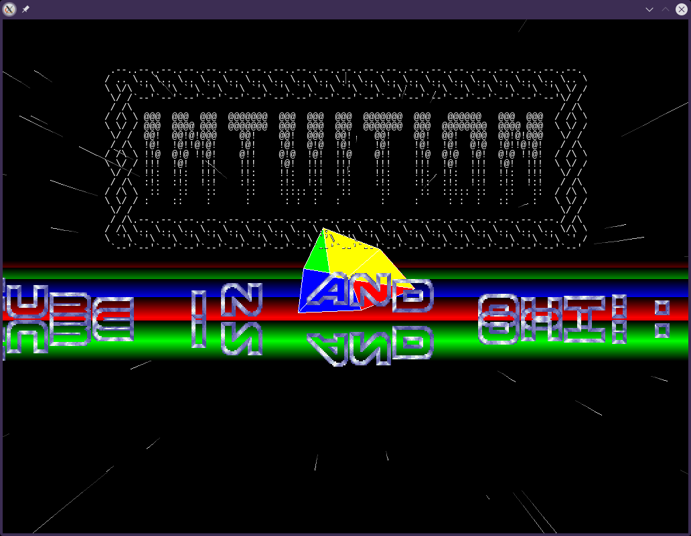

Got bored and made an oldskool crack intro.

Features:

A 3D starfield with faded trails.

A keyboard zoomable rotating cube.

A dual sine wave mirrored scrolltext.

A protracker chiptune.

A bouncing logo for the glories!!!111EleventyOne!!

Requirements:

SDL2 libs for graphics and audio.

veandco/go-sdl2 for Go bindings.

Usage:

go run .

Build:

go build -ldflags="-s -w" .

Tested on Ubuntu 24.04 ARM64 on a Lenovo x13s.

Should work on any platform with Golang and SDL2 support.