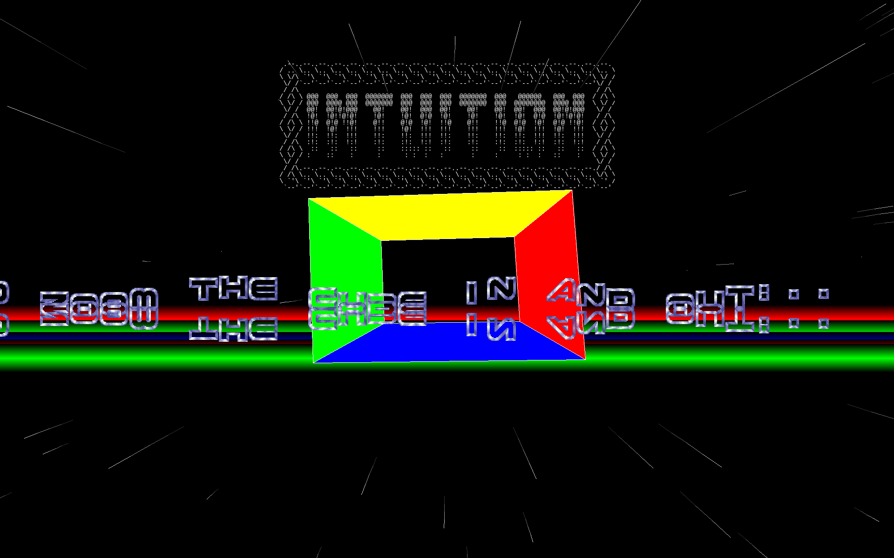

Got bored and made an oldskool crack intro.

Features:

1. A 3D starfield with faded trails.

2. A keyboard zoomable rotating cube.

3. A dual sine wave mirrored scrolltext.

4. A protracker chiptune.

5. A bouncing logo for the glories!!!111EleventyOne!!

6. YPos scrolling Amiga copper bars.

7. "-win" argument on commandline to run in windowed mode.

8. "-win width height" to set window size (default 1024x768).

9. Amiga style graphical decruncher loader 

Requirements:

SDL2 libs for graphics and audio.

veandco/go-sdl2 for Go bindings.

Usage:

go run .

Build:

go build -ldflags="-s -w" .

Tested on Ubuntu 24.04 ARM64 on a Lenovo x13s.

Should work on any platform with Golang and SDL2 support.